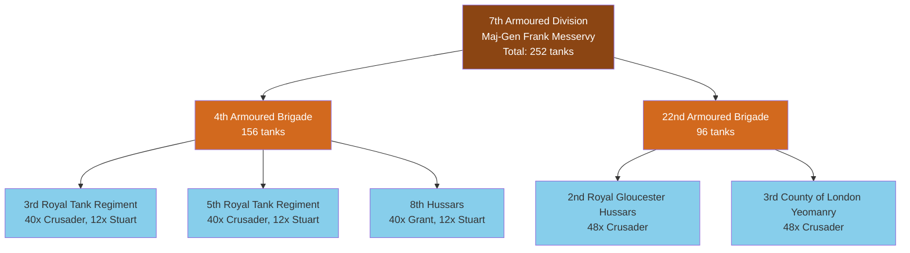

# 7th Armoured Division (Desert Rats) - June 1942

Organization diagram showing tank allocations by brigade and regiment.

## Mermaid Diagram

## Equipment Summary

**Tank Types:**
- 🟦 **Crusader Mk III** (176 tanks)
  - 4th Armoured Brigade: 80 tanks
  - 22nd Armoured Brigade: 96 tanks

- 🟩 **M3 Grant** (40 tanks)
  - 8th Hussars: 40 tanks

- 🟨 **M3 Stuart** (36 tanks)
  - 3rd RTR: 12 tanks (recce)
  - 5th RTR: 12 tanks (recce)
  - 8th Hussars: 12 tanks (recce)

**Support Elements:**
- 7th Motor Brigade (infantry)
- 3rd Regiment Royal Horse Artillery
- Divisional support companies

## Historical Context

On 18 June 1942, during Operation Crusader, the 7th Armoured Division was the most heavily armored formation in British 8th Army. The division earned its "Desert Rats" nickname and played a crucial role in the Western Desert Campaign.

**Tank Performance:**
- **Crusader**: Fast, mechanically reliable, but lightly armored (40mm frontal)
- **Grant**: Powerful 75mm gun in hull sponson, better armor (50mm)
- **Stuart**: Excellent reliability, but 37mm gun inadequate vs German armor

## Source

Generated from British 8th Army TO&E data (1942-Q2).
See: `data/output/units/british_1942q2_7th_armoured_division_toe.json` (when created)
