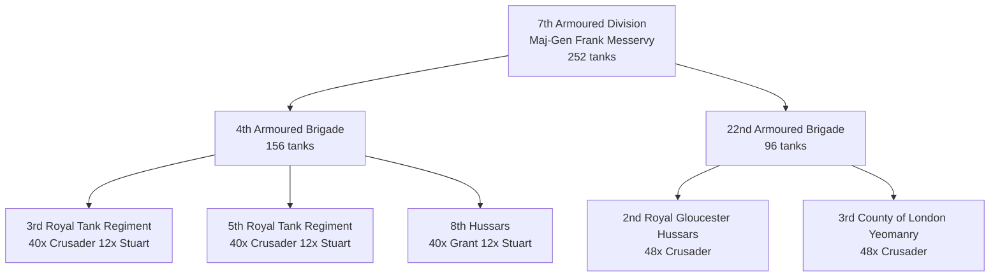

# 7th Armoured Division (Desert Rats) - June 1942 (Simplified)

Simple version without styling for maximum compatibility.

**This version:**
- No quotes around labels
- No comma in equipment lists (simpler)
- No styling
- Maximum compatibility with all Mermaid versions
