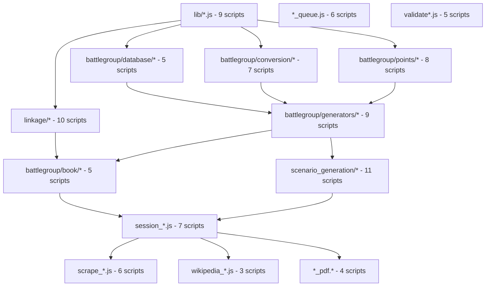

# Script Dependencies Map - Phase 5.5 Phase 0

**Date**: November 3, 2025
**Context**: Pre-normalization dependency analysis
**Purpose**: Document script relationships to guide Phase 5.5 migration

---

## Overview

This document maps dependencies between the 95 active scripts identified in SCRIPT_AUDIT.md. Understanding these dependencies is critical for Phase 5.5 database normalization to ensure:
1. Scripts are migrated in correct order (dependencies first)
2. Database schema changes don't break dependent scripts
3. Backward compatibility views cover all access patterns

---

## Dependency Levels

### Level 0: Core Libraries (9 scripts)
**No dependencies** - Pure utility functions

```
lib/canonical_paths.js
lib/gap_documenter.js
lib/matching.js
lib/naming_standard.js
lib/state_validator.js
lib/unit_completion.js
lib/unit_completion_checker.js
lib/validate_agent_output.js
lib/validator.js
```

**Database Access**: None (pure utilities)
**Migration Priority**: LOW (no database changes needed)

---

### Level 1: Database Access Layer (15 scripts)
**Dependencies**: Level 0 only

#### Phase 9B Equipment Database Access
```
battlegroup/database/enrich_equipment_battlegroup.py
  READ: equipment, equipment_battlegroup, bg_reference_vehicles, bg_reference_guns
  WRITE: equipment_battlegroup (armor, movement, points, BR)
  DEPENDENCIES: None

battlegroup/database/enhance_special_rules.py
  READ: equipment_battlegroup, bg_special_rules
  WRITE: equipment_battlegroup (special_rules field)
  DEPENDENCIES: enrich_equipment_battlegroup.py

battlegroup/conversion/armor_converter.py
  READ: wwiitanks_afv_data, bg_armor_conversion
  WRITE: None (pure conversion)
  DEPENDENCIES: None

battlegroup/conversion/penetration_converter.py
  READ: wwiitanks_gun_data, penetration_data, bg_penetration_scale
  WRITE: None (pure conversion)
  DEPENDENCIES: None

battlegroup/conversion/movement_calculator.py
  READ: bg_movement_values
  WRITE: None (pure conversion)
  DEPENDENCIES: None

battlegroup/conversion/he_calculator.py
  READ: bg_he_effectiveness
  WRITE: None (pure conversion)
  DEPENDENCIES: None

battlegroup/conversion/he_weight_classifier.py
  READ: None (pure logic)
  WRITE: None
  DEPENDENCIES: None
```

#### Phase 9B Points/BR Calculation
```
battlegroup/points/points_calculator.py
  READ: equipment_battlegroup (armor, movement, weapons)
  WRITE: None (calculation only)
  DEPENDENCIES: enrich_equipment_battlegroup.py

battlegroup/points/battle_rating_assigner.py
  READ: equipment_battlegroup (points, category)
  WRITE: None (calculation only)
  DEPENDENCIES: points_calculator.py

battlegroup/points/defence_points_calculator.py
  READ: equipment_battlegroup (armor, category)
  WRITE: None (calculation only)
  DEPENDENCIES: None

battlegroup/points/fire_support_calculator.py
  READ: equipment_battlegroup (he_rating, ap_rating)
  WRITE: None (calculation only)
  DEPENDENCIES: None
```

#### Phase 6 Unit Database Access
```
enrich_units_with_database.js
  READ: equipment, afv_data, guns
  WRITE: None (enriches JSON files)
  DEPENDENCIES: lib/canonical_paths.js, lib/naming_standard.js

enrich_units_with_database.py
  READ: equipment, afv_data, guns
  WRITE: None (enriches JSON files)
  DEPENDENCIES: None
```

#### Equipment Linkage (Phase 9B)
```
linkage/tier2_normalization.py
  READ: equipment_battlegroup, bg_reference_vehicles
  WRITE: equipment_battlegroup (reference_vehicle_id, match_confidence)
  DEPENDENCIES: None

linkage/tier3_base_model.py
  READ: equipment_battlegroup, bg_reference_vehicles
  WRITE: equipment_battlegroup (reference_vehicle_id, match_confidence)
  DEPENDENCIES: tier2_normalization.py

linkage/tier4_artillery_linkage.py
  READ: equipment_battlegroup, bg_reference_guns
  WRITE: equipment_battlegroup (reference_gun_id, match_confidence)
  DEPENDENCIES: None
```

**Migration Priority**: **CRITICAL** - Must migrate FIRST to establish new database access patterns

---

### Level 2: Business Logic (25 scripts)
**Dependencies**: Level 0, Level 1

#### Phase 9B Generators
```
battlegroup/generators/datacard_generator.py
  READ: equipment_battlegroup, bg_reference_vehicles, bg_reference_guns
  DEPENDENCIES:
    - battlegroup/database/enrich_equipment_battlegroup.py
    - battlegroup/conversion/armor_converter.py
    - battlegroup/conversion/penetration_converter.py
    - battlegroup/conversion/movement_calculator.py
    - battlegroup/conversion/he_calculator.py
    - battlegroup/points/points_calculator.py
    - battlegroup/points/battle_rating_assigner.py

battlegroup/generators/army_list_generator.py
  READ: equipment_battlegroup, units
  DEPENDENCIES:
    - battlegroup/points/points_calculator.py
    - battlegroup/points/battle_rating_assigner.py

battlegroup/generators/force_roster_builder_v2.py
  READ: equipment_battlegroup, units
  DEPENDENCIES:
    - battlegroup/generators/army_list_generator.py

battlegroup/generators/historical_scenario_generator.py
  READ: units (Phase 6 JSONs)
  DEPENDENCIES:
    - battlegroup/generators/phase6_unit_parser.py

battlegroup/generators/phase6_unit_parser.py
  READ: units (Phase 6 JSONs)
  DEPENDENCIES: None

battlegroup/generators/random_scenario_generator.py
  READ: equipment_battlegroup, units
  DEPENDENCIES:
    - battlegroup/generators/army_list_generator.py
```

#### Phase 9B Book Generation
```
battlegroup/book/generate_book_datacards.py
  READ: equipment_battlegroup, bg_reference_vehicles, bg_reference_guns
  DEPENDENCIES:
    - battlegroup/generators/datacard_generator.py
    - linkage/tier2_normalization.py
    - linkage/tier3_base_model.py
    - linkage/tier4_artillery_linkage.py

battlegroup/book/scenario_force_parser_v2.py
  READ: None (parses text)
  DEPENDENCIES: None

battlegroup/book/scenario_generator_workflow.py
  READ: units (Phase 6 JSONs)
  DEPENDENCIES:
    - battlegroup/book/scenario_force_parser_v2.py
    - battlegroup/generators/historical_scenario_generator.py
    - battlegroup/force_composition_validator.py

battlegroup/force_composition_validator.py
  READ: None (validates structure)
  DEPENDENCIES:
    - battlegroup/book/scenario_force_parser_v2.py
```

#### Scenario Export (Phase 9A)
```
scenario_generation/converters/armor_converter.py
  READ: wwiitanks_afv_data
  DEPENDENCIES: None

scenario_generation/converters/battle_rating_assigner.py
  READ: equipment_battlegroup
  DEPENDENCIES: battlegroup/points/battle_rating_assigner.py

scenario_generation/converters/penetration_converter.py
  READ: wwiitanks_gun_data, penetration_data
  DEPENDENCIES: None

scenario_generation/converters/points_estimator.py
  READ: equipment_battlegroup
  DEPENDENCIES: battlegroup/points/points_calculator.py

scenario_generation/game_exporters/witw_exporter.py
  READ: units, equipment
  DEPENDENCIES:
    - scenario_generation/base/scenario_exporter.py
    - scenario_generation/converters/armor_converter.py
    - scenario_generation/converters/penetration_converter.py

scenario_generation/game_exporters/battlegroup_exporter.py
  READ: units, equipment_battlegroup
  DEPENDENCIES:
    - scenario_generation/base/scenario_exporter.py
    - scenario_generation/converters/battle_rating_assigner.py
    - scenario_generation/converters/points_estimator.py

generate_scenario_exports.py
  READ: units
  DEPENDENCIES:
    - scenario_generation/game_exporters/witw_exporter.py
    - scenario_generation/game_exporters/battlegroup_exporter.py
```

**Migration Priority**: **HIGH** - Core content generation depends on database access layer

---

### Level 3: Workflow Orchestration (18 scripts)
**Dependencies**: Level 0, Level 1, Level 2

#### Session Management
```
session_start.js
  READ: workflow_state.json
  WRITE: workflow_state.json
  DEPENDENCIES:
    - validate_session_readiness.js
    - generate_work_queue.js
    - lib/canonical_paths.js
    - lib/naming_standard.js
    - lib/state_validator.js

session_end.js
  READ: workflow_state.json
  WRITE: workflow_state.json, SESSION_SUMMARY.md
  DEPENDENCIES:
    - lib/state_validator.js
    - git_auto_commit.js

validate_session_readiness.js
  READ: workflow_state.json, work_queue.json
  DEPENDENCIES:
    - lib/state_validator.js
    - lib/canonical_paths.js

create_checkpoint.js
  READ: workflow_state.json
  WRITE: Git commit
  DEPENDENCIES:
    - validate-schema.js
    - lib/state_validator.js
    - git_auto_commit.js

checkpoint_safe.js
  READ: workflow_state.json
  WRITE: Git commit
  DEPENDENCIES:
    - create_checkpoint.js
    - validate-schema.js
    - validate-no-wikipedia.js

recover_from_crash.js
  READ: workflow_state.json
  WRITE: workflow_state.json
  DEPENDENCIES:
    - lib/state_validator.js

git_auto_commit.js
  READ: Git status
  WRITE: Git commit
  DEPENDENCIES: None
```

#### Work Queue Management
```
generate_work_queue.js
  READ: units (Phase 6 JSONs), workflow_state.json
  WRITE: work_queue.json
  DEPENDENCIES:
    - lib/canonical_paths.js
    - lib/naming_standard.js
    - lib/unit_completion_checker.js

validate_work_queue.js
  READ: work_queue.json, units
  DEPENDENCIES:
    - lib/canonical_paths.js
    - lib/validator.js

collect_discoveries.js
  READ: units (discovered_units arrays)
  WRITE: discovered_units.json
  DEPENDENCIES:
    - lib/canonical_paths.js

add_discovered_to_queue.js
  READ: discovered_units.json, work_queue.json
  WRITE: work_queue.json
  DEPENDENCIES:
    - generate_work_queue.js

consolidate_canonical.js
  READ: units (all JSONs)
  WRITE: units (canonical files)
  DEPENDENCIES:
    - lib/canonical_paths.js
    - lib/naming_standard.js

archive_old_sessions.js
  READ: sessions/ directory
  WRITE: archive/ directory
  DEPENDENCIES: None

process_queue_auto.js
  READ: work_queue.json
  WRITE: units, workflow_state.json
  DEPENDENCIES:
    - generate_work_queue.js
    - validate_work_queue.js
    - enrich_units_with_database.js

resume_paused_unit.js
  READ: workflow_state.json
  WRITE: workflow_state.json
  DEPENDENCIES:
    - lib/state_validator.js
```

#### Validation Orchestration
```
validate-schema.js
  READ: units (all JSONs), schemas/unified_toe_schema.json
  DEPENDENCIES:
    - lib/validator.js
    - lib/validate_agent_output.js

validate-no-wikipedia.js
  READ: units (all JSONs)
  DEPENDENCIES:
    - lib/verify_source_citations.js

qa_audit.js
  READ: units, equipment, database
  DEPENDENCIES:
    - validate-schema.js
    - validate-no-wikipedia.js
    - lib/validator.js
```

**Migration Priority**: **MEDIUM** - Workflow depends on data access but not database structure

---

### Level 4: User-Facing Commands (15 scripts)
**Dependencies**: Level 0-3

#### Wikipedia Management
```
manage_wikipedia_upgrade.js
  READ: units (source_citations)
  WRITE: units (upgraded citations)
  DEPENDENCIES:
    - lib/verify_source_citations.js
    - validate-no-wikipedia.js

remove-wikipedia-sources.js
  READ: units
  WRITE: units
  DEPENDENCIES:
    - lib/verify_source_citations.js

list_wikipedia_and_no_source_units.js
  READ: units
  DEPENDENCIES:
    - lib/verify_source_citations.js
```

#### Data Scraping
```
scrape_wwiitanks.js
  READ: wwiitanks.com web pages
  WRITE: sources/wwiitanks_afv_data.json
  DEPENDENCIES: None (external data source)

scrape_wwiitanks_enhanced_guns_v2.js
  READ: wwiitanks.com web pages
  WRITE: sources/wwiitanks_gun_data.json, penetration_data
  DEPENDENCIES: None (external data source)

battlegroup/scrapers/datacard_scraper.py
  READ: BattleGroup PDFs
  WRITE: sources/bg_reference_vehicles.csv, bg_reference_guns.csv
  DEPENDENCIES: None (external data source)
```

#### PDF Processing
```
search_sources.js
  READ: Resource Documents/ PDFs
  DEPENDENCIES: None

prepare_source_for_agent.js
  READ: PDFs
  WRITE: Prepared text chunks
  DEPENDENCIES:
    - extract_pdf_chunks.js

extract_pdf_chunks.js
  READ: PDFs
  WRITE: Chunked text
  DEPENDENCIES: None

ocr_pdf_chunks.py
  READ: PDF images
  WRITE: OCR text
  DEPENDENCIES: None
```

#### MCP Tools
```
setup-mcp.js
  WRITE: .mcp/config.json
  DEPENDENCIES: None

test-mcp.js
  READ: .mcp/config.json
  DEPENDENCIES: setup-mcp.js

memory_mcp_helpers.js
  READ/WRITE: MCP memory server
  DEPENDENCIES: None
```

**Migration Priority**: **LOW** - User commands depend on business logic, not database structure

---

## Critical Dependency Chains

### Phase 9B Equipment Datacard Generation
```
CRITICAL PATH (affects publication):

linkage/tier2_normalization.py
  ↓
linkage/tier3_base_model.py
  ↓
linkage/tier4_artillery_linkage.py
  ↓
battlegroup/database/enrich_equipment_battlegroup.py
  ↓
battlegroup/conversion/* (5 converters)
  ↓
battlegroup/points/* (4 calculators)
  ↓
battlegroup/generators/datacard_generator.py
  ↓
battlegroup/book/generate_book_datacards.py
  ↓
MDBook HTML generation
```

**Database Tables Accessed**:
- `equipment` (469 North Africa items)
- `equipment_battlegroup` (469 enriched items)
- `bg_reference_vehicles` (500 reference vehicles)
- `bg_reference_guns` (57 reference guns)
- `bg_armor_conversion` (16 conversion rules)
- `bg_penetration_scale` (24 penetration mappings)
- `bg_movement_values` (20 movement ranges)
- `bg_he_effectiveness` (9 HE ranges)
- `bg_special_rules` (57 rules, 1,599 linkages)
- `wwiitanks_afv_data` (612 AFVs - fallback)
- `wwiitanks_gun_data` (343 guns - fallback)
- `penetration_data` (1,296 values - fallback)

**Phase 5.5 Impact**: ALL these tables will be replaced by:
- `equipment_master` (1,400-1,700 items)
- `equipment_name_variants` (2,000-3,000 variants)
- `equipment_stats_battlegroup` (game-specific stats)
- `equipment_theater_usage` (theater assignments)
- `equipment_nation_usage` (nation assignments)

**Migration Strategy**: Create backward compatibility VIEWs to minimize script changes

---

### Phase 9A Scenario Export
```
CRITICAL PATH (WITW CSV export):

Phase 6 unit JSONs (data/output/units/*.json)
  ↓
scenario_generation/base/scenario_exporter.py
  ↓
scenario_generation/converters/* (4 converters)
  ↓
scenario_generation/game_exporters/witw_exporter.py
  ↓
generate_scenario_exports.py
  ↓
WITW CSV files (369 scenarios)
```

**Database Tables Accessed**:
- `equipment` (WITW baseline - 469 items)
- `units` (144 WITW units)
- `unit_equipment` (equipment assignments)
- `wwiitanks_afv_data` (armor conversion)
- `wwiitanks_gun_data` (penetration conversion)

**Phase 5.5 Impact**: `equipment` table replaced by `equipment_master`
**Migration Strategy**: CREATE VIEW equipment AS SELECT... FROM equipment_master

---

### Phase 6 Unit Enrichment
```
WORKFLOW (continuous):

Agent extraction → Phase 6 unit JSON
  ↓
enrich_units_with_database.js
  ↓
Read: equipment, afv_data, guns
  ↓
Enrich JSON: equipment specs, production dates
  ↓
validate-schema.js (v3.1.0 compliance)
  ↓
checkpoint_safe.js (git commit)
```

**Database Tables Accessed**:
- `equipment` (469 North Africa items)
- `afv_data` (213 OnWar vehicles)
- `guns` (343 WWIItanks guns)

**Phase 5.5 Impact**: ALL three tables replaced by `equipment_master`
**Migration Strategy**: Backward compatibility VIEWs + script updates

---

## Database Access Patterns by Script

### Read-Only Access (Safe to migrate last)
Scripts that only READ database, no writes:

```
battlegroup/conversion/* (7 scripts)
battlegroup/points/* (8 scripts)
battlegroup/generators/* (9 scripts)
battlegroup/book/scenario_force_parser_v2.py
battlegroup/force_composition_validator.py
scenario_generation/converters/* (4 scripts)
scenario_generation/game_exporters/* (2 scripts)
generate_scenario_exports.py
enrich_units_with_database.js
enrich_units_with_database.py
```

**Total**: 33 read-only scripts
**Migration Strategy**: Use backward compatibility VIEWs, no script changes needed

---

### Read-Write Access (Must migrate carefully)
Scripts that WRITE to database:

```
battlegroup/database/enrich_equipment_battlegroup.py
  WRITE: equipment_battlegroup (armor, movement, points, BR, weapons)

battlegroup/database/enhance_special_rules.py
  WRITE: equipment_battlegroup (special_rules)

linkage/tier2_normalization.py
  WRITE: equipment_battlegroup (reference_vehicle_id, match_confidence)

linkage/tier3_base_model.py
  WRITE: equipment_battlegroup (reference_vehicle_id, match_confidence)

linkage/tier4_artillery_linkage.py
  WRITE: equipment_battlegroup (reference_gun_id, match_confidence)
```

**Total**: 5 read-write scripts
**Migration Strategy**:
1. Update to write to `equipment_stats_battlegroup` instead of `equipment_battlegroup`
2. Use `equipment_master.master_id` as foreign key
3. Join via `equipment_name_variants` for name matching

---

### SQL-Only Scripts (Direct database manipulation)
```
linkage/tier1_exact_matches.sql
linkage/tier2_normalized_matches.sql
linkage/tier3_base_model_matches.sql
linkage/tier3_5_stuart_linkage.sql
linkage/tier3_6_common_tanks_linkage.sql
linkage/tier4_artillery_matches.sql
linkage/add_reference_gun_id.sql
linkage/execute_all_tiers.sql
battlegroup/database/step4_schema.sql
```

**Total**: 9 SQL scripts
**Migration Strategy**: Rewrite SQL queries for new schema in Phase 5.5 Phase 5

---

## Migration Priority by Dependency Level

### Phase 5.5 Migration Order

**Phase 1** (8 hours): Create new schema
- Create `equipment_master`, `equipment_name_variants`, `equipment_stats_battlegroup` tables
- Import data from old tables
- Create backward compatibility VIEWs

**Phase 2** (12 hours): Name variant generation
- Generate 2,000+ name variants
- Populate `equipment_name_variants`

**Phase 3** (16 hours): Complete equipment matching
- Re-run matching with name variants
- Enrich `equipment_master.historical_specs_json`

**Phase 4** (8 hours): Deduplication
- Deduplicate `bg_reference_vehicles` (500 → ~450)
- Merge gun tables

**Phase 5** (16 hours): Script migration
- **Priority 1**: Level 1 database access scripts (5 read-write scripts)
- **Priority 2**: Level 2 business logic (25 scripts using backward VIEWs)
- **Priority 3**: Level 3 workflow (18 scripts - no changes needed)
- **Priority 4**: Level 4 user commands (15 scripts - no changes needed)

**Phase 6** (4 hours): Validation
- Test all 95 active scripts
- Validate 100% equipment linkage
- Final QA suite

---

## Backward Compatibility Views (Phase 5.5 Phase 1)

### Critical VIEWs to Create

```sql
-- Allow old scripts to access equipment table
CREATE VIEW equipment AS
SELECT
  em.master_id as canonical_id,
  em.canonical_name as name,
  em.equipment_category as category,
  em.original_nation as nation,
  json_extract(em.historical_specs_json, '$.witw_id') as witw_id,
  json_extract(em.historical_specs_json, '$.display_name') as display_name
FROM equipment_master em
JOIN equipment_theater_usage etu ON em.master_id = etu.master_id
WHERE etu.theater = 'north_africa';

-- Allow old scripts to access equipment_battlegroup table
CREATE VIEW equipment_battlegroup AS
SELECT
  eb.stat_id,
  em.master_id as canonical_id,
  em.canonical_name as name,
  eb.armor_front,
  eb.armor_side,
  eb.armor_rear,
  eb.movement_offroad,
  eb.movement_road,
  eb.he_rating,
  eb.ap_rating,
  eb.points,
  eb.battle_rating,
  eb.special_rules,
  eb.conversion_confidence
FROM equipment_master em
JOIN equipment_stats_battlegroup eb ON em.master_id = eb.master_id
JOIN equipment_theater_usage etu ON em.master_id = etu.master_id
WHERE etu.theater = 'north_africa';

-- Allow old scripts to access afv_data table
CREATE VIEW afv_data AS
SELECT
  em.master_id as id,
  em.canonical_name as name,
  em.original_nation as nation,
  json_extract(em.historical_specs_json, '$.weight_tons') as weight_tons,
  json_extract(em.historical_specs_json, '$.crew') as crew,
  json_extract(em.historical_specs_json, '$.production_years') as production_years
FROM equipment_master em
WHERE em.equipment_category IN ('tank', 'vehicle', 'armored_car', 'self_propelled_gun');

-- Allow old scripts to access guns table
CREATE VIEW guns AS
SELECT
  em.master_id as id,
  em.canonical_name as name,
  em.original_nation as nation,
  json_extract(em.historical_specs_json, '$.caliber_mm') as caliber_mm,
  json_extract(em.historical_specs_json, '$.gun_type') as type
FROM equipment_master em
WHERE em.equipment_category IN ('gun', 'artillery', 'anti_tank_gun', 'anti_aircraft_gun');
```

These VIEWs allow **33 read-only scripts** to continue working without modification during Phase 5.5.

---

## Testing Strategy

### Phase 5.5 Phase 5 Testing Plan

**Test Suite 1**: Core workflow (18 scripts)
```bash
npm run session:start
npm run queue:generate
npm run checkpoint:safe
npm run session:end
```
**Expected**: All commands succeed, no errors

**Test Suite 2**: Phase 9B datacards (10 scripts)
```bash
python scripts/battlegroup/book/generate_book_datacards.py --battle battleaxe
```
**Expected**: Datacards generated with 100% equipment linkage

**Test Suite 3**: Phase 9A scenario export (5 scripts)
```bash
python scripts/generate_scenario_exports.py
```
**Expected**: 369 WITW CSV files generated

**Test Suite 4**: Validation (3 scripts)
```bash
npm run validate:v3
npm run validate:sources
npm run qa:audit
```
**Expected**: All validations pass

---

## Documentation Updates Required

### Files to Update Post-Migration

1. **CLAUDE.md** - Database architecture section
2. **PROJECT_SCOPE.md** - Phase 5.5 status, Phase 9B equipment linkage
3. **START_HERE_NEW_SESSION.md** - Command reference
4. **VERSION_HISTORY.md** - Schema v4.0.0 changelog
5. **NEW: DATABASE_ARCHITECTURE.md** - Comprehensive guide

---

## Appendix: Full Dependency Graph

### Visual Representation (Mermaid)



---

**Document Date**: November 3, 2025
**Next Steps**: Use this dependency map to guide Phase 5.5 Phase 5 script migration
**Critical Path**: Equipment datacard generation (8-script chain)
